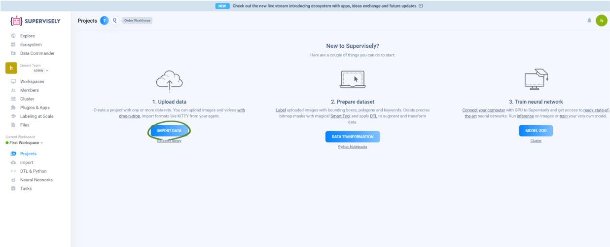
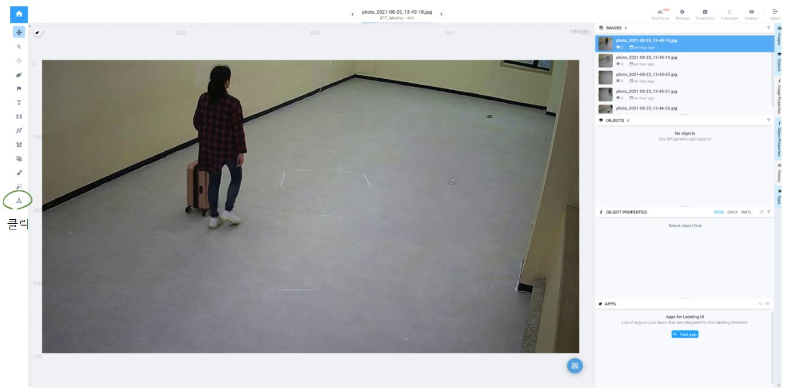

# supervisely 사용법      

## data labeling

인공지능의 세 가지 요소는 알고리즘, 모델, 데이터이다. 그중 데이터의 개수는 인공지능 성능에 큰 영향을 미친다.
인공지능은 데이터의 수가 많아질수록 정확도가 증가하고 여러 가지 다른 알고리즘들의 정확도가 수렴하여 같아지게 된다.
가장 좋은 알고리즘보다는 데이터를 가장 많이 가진 것이 더 정확한 알고리즘을 완성시킨다. 

모델의 학습방법에는 supervised learning과 unsupervised learning이 있다. supervised learning은 raw data와 그 데이터에 관련된 labbel값을 같이 학습시키는 방법이고 unsupervised learning은 오직 raw data만을 학습시키는 방법이다. supervised learning방법으로 모델을 학습시킬 때 label이 없는 data의 경우는 직접 label을 만드는 labeling작업을 진행해야 한다. 하지만 data의 양은 많을 수록 좋으므로 수작업으로 labeling할 data의 수도 많아지게 된다. 여기서는 본인이 많은 tool을 써본결과 가장 유용하고 편리한 tool인 supervisely을 소개하겠다.  

## supervisely란?

supervisely은 웹 기반 Dataset Annotation Tool이다. 쉽게 말하면 데이터의 라벨을 생성하는 라벨링 작업을 진행할 때 사용하는 tool이다. 데이터 라벨링은 필요에 따라 다양한 방법으로 할 수 있는데 supervisely은 keypoint, bounding box, segmentation labeling 방식이 가능하다.      

이 문서에서는 가장 까다롭다고 생각하는 keypoint labeling 방식을 설명하도록 하겠다. 참고로 supervisely은 최대 1,000장까지 무료이므로 1,000장씩 끊어서 사용할 것을 권장한다.  

## supervisely 사용법

###  1. 계정 만들기 

1-1. 가장 먼저 아래 링크(supervisely)에 들어간다.

supervisely https://supervise.ly/  

1-2. Log in을 클릭한다. 

  

1-3. 계정이 있다면 로그인을 진행하고 계정이 없다면 Sign up을 진행한다. 

  

###  2. project 만들기  

2-1. 아래 화면은 로그인 후 나온 화면이다. 이 화면에서 좌측 Projects를 클릭하여 project를 생성한다. 

  

2-2. 1.Upload data의 IMPORT DATA을 클릭한다. 라벨링 할 데이터를 업로드하기 위한 작업이다. 

  

2-3. 라벨링을 하기 전 데이터 설정을 하는 과정이다. 가장 위칸에서는 데이터의 형식을 지정한다. 여기서는 이미지 라벨링을 진행할 것이므로 images를 선택한다. 그리고 가장 아래 드래그를 이용하여 라벨링을 진행할 데이터를 업로드한다. 

  

2-4. project 이름 설정 후 project를 생성한다. 

  
  

###  3. class 만들기  

3-1. project 생성 후 class를 만들어야 한다. 아래 사진과 같이 Projects를 클릭한 후 작업할 project를 클릭한다. 

  

3-2. project 클릭 후 Classes를 클릭한다. 그리고 +NEW 버튼을 클릭한다.  

  
  

3-3. title과 shape을 설정한다. shape은 어떤 방식으로 라벨링을 진행할 것인지에 대한 정보이다. 앞서 말했듯이 예제에서는 keypoint로 라벨링을 할 것이기 때문에 keypoint를 선택한다. 

  

3-4. Keypoints Template를 생성한다. Shape 설정에서 keypoints 선택했기 때문에 Keypoints Template을 생성해야 하는데 이 예제에서는 사람을 라벨링할 것이기 때문에 오른쪽 사진과 같이 Keypoint를 생성해야 한다. 사람의 Keypoint는 보통 15개로 지정하고 관절부분을 Keypoint라고 생각하면 된다. 

  

3-5. Add Node를 클릭 후 15개의 노드(Keypoint)를 생성한다. 

  

3-6. Add Edge를 클릭 후 드래그로 노드 연결한다. 

  

3-7. 노드들의 label과 color를 변경한다. 이 예제에서는 label은 노드 번호(명칭)으로 설정하였고 color는 다른 노드들과 겹치지 않도록 랜덤하게 설정하였다. 설정방법은 노드를 클릭 후 마우스 오른쪽을 클릭하면 가능하다. 모든 설정 후 SAVE를 클릭한다. 

  

###  4. labeling 진행  

4-1. 이제 keypoint방법을 사용하는 데이터 labeling을 진행한다. 아래 사진과 같이 projects를 클릭하고 작업할 project 선택한다. 

  

4-2. labeling할 객체의 왼쪽 상단을 클릭 후 오른쪽 하단을 클릭한다. 여기서는 사람을 labeling할 것이기 때문에 아래 사진과 같이 클릭한다. 

  

4-3. 위 사진을 보면 15개의 노드가 정확하게 사람의 관절에 위치않다는 것을 알 수 있다. 그러므로 객체에 맞춰 노드의 위치를 조정해줘야 한다. 노드의 위치가 헷갈린다면 오른쪽 사진을 참고하여 위치를 조정한다. 왼쪽 사진이 노드를 이동한 후 결과이다.  

  

###  5. labeling sample 이미지  

5-1. 아래 sample은 정면기준일 때와 뒷모습일 때를 설명하기 위한 sample이다. 뒷모습일경우에는 left와 right를 반대로 반영해야 한다. 아래 사진을 보면 정확히 이해할 수 있을 것이다.  

  

5-2. 이번 sample은 keypoint가 가려지는 경우이다. 이 경우에는 노드의 위치를 예측해서 labeling해야 한다. 

  

###  6. 다운로드  

labeling 작업을 마쳤다면 다운로드를 해야한다. 아래 사진과 같이 점을 클릭하고 Download as 클릭 후 .json 클릭하면 labeling 정보가 json으로 저장되어 있는 파일이 다운로드된다. 

  
