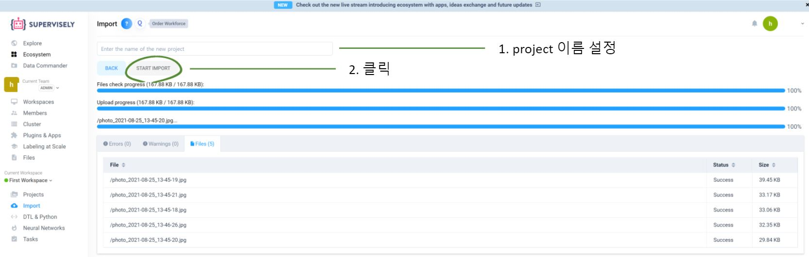
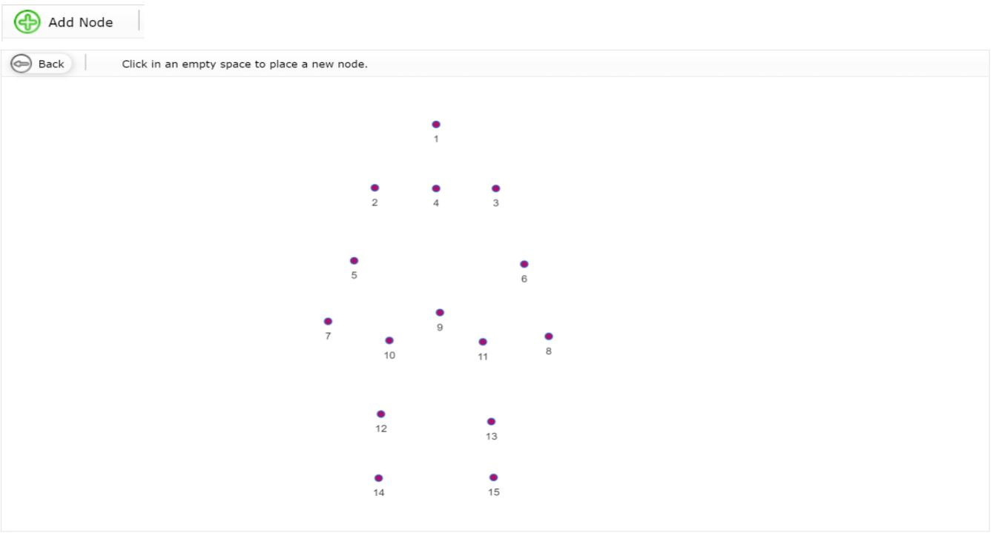

# supervisely 사용법      

## data labeling

인공지능의 세 가지 요소는 알고리즘, 모델, 데이터이다. 그중 데이터의 개수는 인공지능 성능에 큰 영향을 미친다.
인공지능은 데이터의 수가 많아질수록 정확도가 증가하고 여러 가지 다른 알고리즘들의 정확도가 수렴하여 같아지게 된다.
가장 좋은 알고리즘보다는 데이터를 가장 많이 가진 것이 더 정확한 알고리즘을 완성시킨다.

supervised learning을 사용하는 인공지능은 데이터뿐만 아니라 데이터의 label도 필요한 learning 방식이다. raw 데이터만을 가지고 있는 경우에는 데이터 라벨링 작업이
필수적이다. 이 작업을 하기 위한 여러 가지 툴이 존재하는데 여기서는 supervisely tool을 소개한다.

## supervisely란?

supervisely은 웹 기반 Dataset Annotation Tool이다. 쉽게 말하면 데이터의 라벨을 생성하는 라벨링 작업을 진행할 때 사용하는 tool이다. 데이터 라벨링은 필요에 따라 다양한 방법으로 할 수 있는데 supervisely은 keypoint, bounding box, segmentation labeling 방식이 가능하다.      

이 문서에서는 가장 까다롭다고 생각하는 keypoint labeling 방식을 설명하도록 하겠다. 참고로 supervisely은 최대 1,000장까지 무료이므로 1,000장씩 끊어서 사용할 것을 권장한다.  

## supervisely 사용법

###  1. 계정 만들기 

1-1. 가장 먼저 아래 링크(supervisely)에 들어간다.

supervisely https://supervise.ly/  

1-2. Log in을 클릭한다. 

  

1-3. 계정이 있다면 로그인을 진행하고 계정이 없다면 Sign up을 진행한다. 

  

###  2. project 만들기  

2-1. 아래 화면은 로그인 후 나온 화면이다. 이 화면에서 좌측 Projects를 클릭하여 project를 생성한다. 

  

2-2. 1.Upload data의 IMPORT DATA을 클릭한다. 라벨링 할 데이터를 업로드하기 위한 작업이다. 

  

2-3. 라벨링을 하기 전 데이터 설정을 하는 과정이다. 가장 위칸에서는 데이터의 형식을 지정한다. 여기서는 이미지 라벨링을 진행할 것이므로 images를 선택한다. 그리고 가장 아래 드래그를 이용하여 라벨링을 진행할 데이터를 업로드한다. 

  

2-4. project 이름 설정 후 project를 생성한다. 

  
  

###  3. class 만들기  

3-1. project 생성 후 class를 만들어야 한다. 아래 사진과 같이 Projects를 클릭한 후 작업할 project를 클릭한다. 

  

3-2. project 클릭 후 Classes를 클릭한다. 그리고 +NEW 버튼을 클릭한다.  

  
  

3-3. title과 shape을 설정한다. shape은 어떤 방식으로 라벨링을 진행할 것인지에 대한 정보이다. 앞서 말했듯이 예제에서는 keypoint로 라벨링을 할 것이기 때문에 keypoint를 선택한다. 

  

3-4. Keypoints Template를 생성한다. Shape 설정에서 keypoints 선택했기 때문에 Keypoints Template을 생성해야 하는데 이 예제에서는 사람을 라벨링할 것이기 때문에 오른쪽 사진과 같이 Keypoint를 생성해야 한다. 사람의 Keypoint는 보통 15개로 지정하고 관절부분을 Keypoint라고 생각하면 된다. 

  

3-5. Add Node를 클릭 후 15개의 노드(Keypoint)를 생성한다. 

  

3-6. Add Edge를 클릭 후 드래그로 노드 연결한다. 

  
